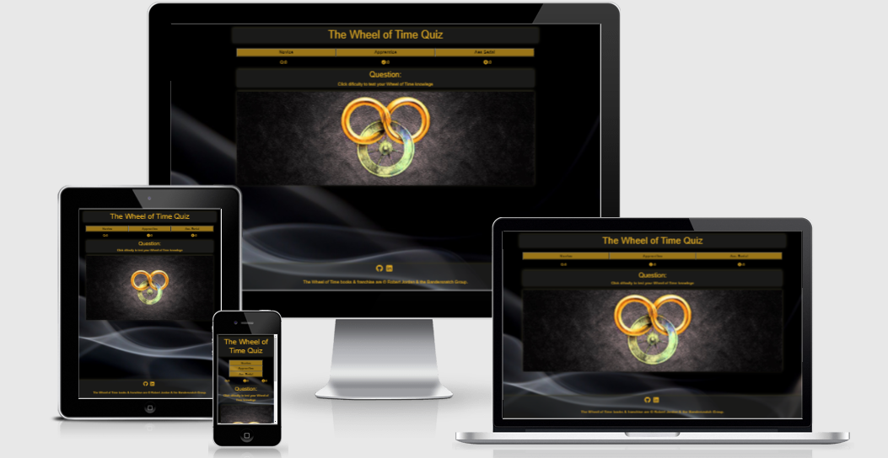
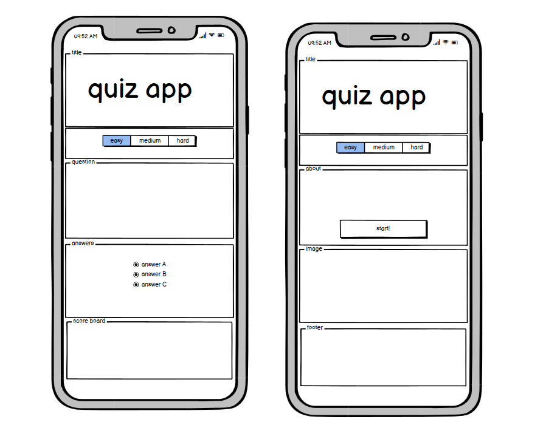
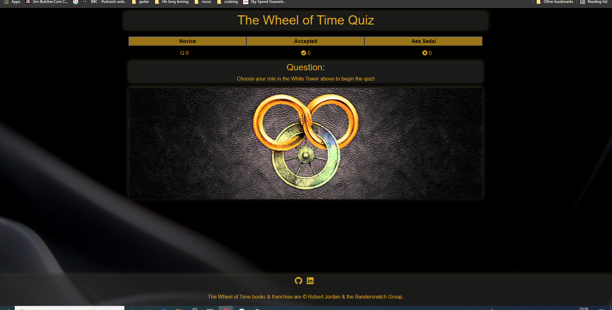
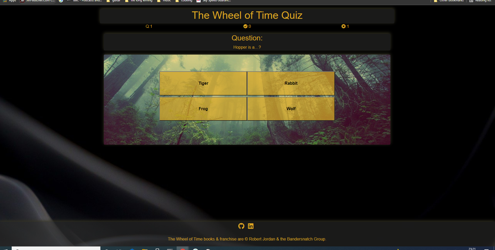
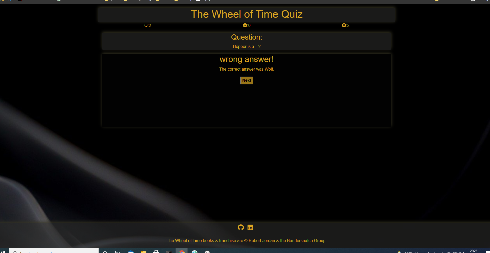
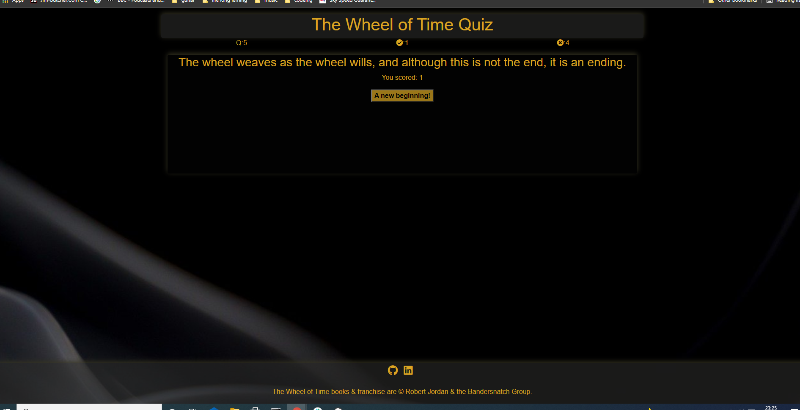
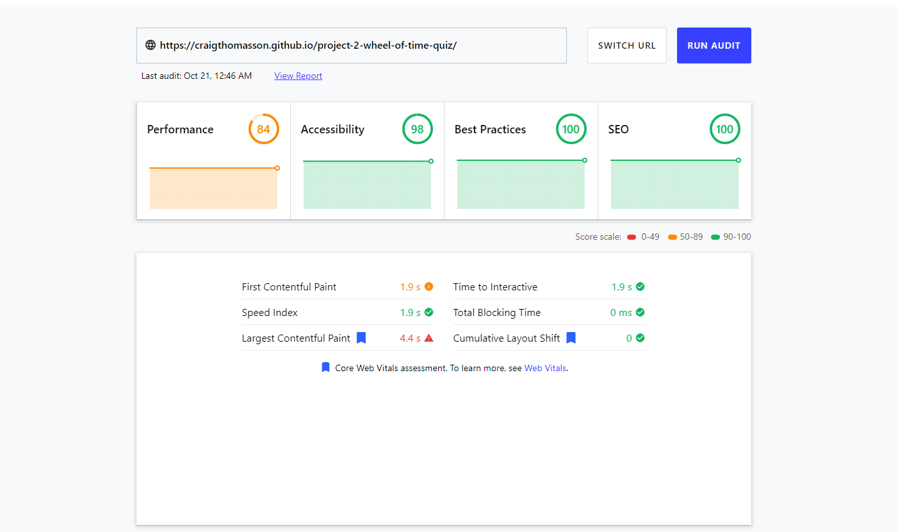

# Wheel of Time Quiz 
Click [here](https://craigthomasson.github.io/project-2-wheel-of-time-quiz/) to view the live web site 

### responsive design 

## UX

## Strategy
 

## Goals
* Create fun interactive quiz that fans of the wheel of time book series will enjoy playing
* To make the quiz repayable through the use of 3 sets of question with increasing levels of difficult  questions to answer
* To make the quiz intuitive to use and provide satisfying feedback for the user
* Design a quiz that is aesthetically pleasing
* To make the quiz responsive

##### To achieve these goals I will need to:
* Use JavaScript to create a fictional quiz
* Use CSS and HTML for the content and to make it look good
* Use relative and accurate source material for the quiz
* Test the quiz with fans of the book series 

## Wireframe for Original Concept

 

## Functionality/UserStory

## Load Screen

* On the load screen the user will see the title and wheel of time logo and see clearly the intentions the page. There are instructed to select their role to begin the quiz. The original color scheme was red black and gold but the red on black was not accessible for all user so the color scheme is now black and gold. This scheme matches a set of book covers in a more recent addition of the books so should have a good wheel of time feel to it. 
* The user will see the instruction for how to begin and the buttons to progress are clear to see.
* The user is present with 3 options Novice, Apprentice and Aes Sedai these are positions within the White Tower in the wheell of Time series and book fans will understand there meaning and feel a little more immersed in the quiz. This also gives a sense of progression moving through the roles. 

## questions and answers

* When the user begins the quiz a question with 4 possible answers are generated as well as an image that is related to the question but not the answer. 
* The questions are each in their own button. When clicked they will generate a correct or incorrect box depending on if they click the right or wrong answer. 
 

## response box

* Once the user selects an answer they will see a correct or incorrect answer box
* The correct answer box confirms the answer is correct and display a button to move to the next question
* The incorrect answer box tell the user the answer was wrong and also displays the correct answer. There is also a button to move on to the next question. 
* Once a question is answered the user will also see the question counter move up as well as the correct and incorrect answer counter. This helps the user keep track of their progress. 

## endquiz box

* When the user has answered 5 questions the quiz will end and a box will displayed informing the user of this
* The box contains a message with text inspired by a popular phrase in the book series this should help the user stay immersed in the theme of the quiz. 
* The users score is also displayed.
* There is a button to return the user to the load page. This button also contains text thematically in line with the book series. 

## Footer

* The Footer is styled to match the header and to close off the page in an aesthetically pleasing way.
* It contains links to my github, linkedin and also copyright info.

## Deployment

This project was deployed to git hub pages.
* In your repository on git hub click settings.
* click the pages tab
* on the drop down under source select your main branch.
* click save

### Clone to Run Locally
* In the repository on github click the Code dropdown button next to the green Gitpod button.
* Download ZIP file and unpackage locally and open with IDE. 

### Fork the Repo
* On GitHub, navigate to the repository you want to fork.
* In the top-right corner of the page, click Fork.

## Testing

* The site was tested in [google chrome](documentation/images/load-page.PNG), [Firefox](documentation/images/firefox.PNG), [Microsoft edge](documentation/edge.PNG) and [safari](documentation/images/safari.PNG).
* It was also tested on [android](documentation/android-test.jpg) and [IOS](documentation/ios-testing.jpg) phones
* As evidenced above I also tested on multiple view ports as evidanced by the images above
* Links in footer where all tested to ensure they link to the correct pages
* The quiz was also play tested by members of a wheel of time fan group on facebook. [playtest-1](documentation/images/playtest-1.PNG) [playtest-2](documentation/images/playtest-2.PNG) [playtest-3](documentation/images/playtest-3.PNG) [playtest-4](documentation/images/playtest-4.PNG)
* 1 bug in the code was found in the play test that caused an extra question to be displayed when the quiz ends. to fix this i simply hid the question box in the end game function.
* Several spelling/gramar issues where also found and fixed
* The feedback for the useability and play ability of the quiz was overwhelmingly positive. The group enjoyed the language inspired by the book and found the quiz somewhat challenging on the harder level.

## Validation

* CSS was ran through (Jigsaw) validator and has no errors: results [here](documentation/images/css-val.PNG)
* HTML was ran through W3C validator with no issues: results <a href="http://validator.w3.org/check?uri=https://craigthomasson.github.io/project-2-wheel-of-time-quiz/">here</a>
* JS was ran through JSHint whith [these](documentation/images/js-val.PNG) results. (there where also several missing semicolans that i added befre taking this screen shot.)

## Lighthouse Scores

* these are results from my second run. in my first run i had to add margins to dif buttons for mobile sizes and meta discription in the head of the HTML.

## Technologies used
HTML, CSS and JavaScript.

## credits 

### Sources and References
* google fonts where used in this project https://fonts.google.com/
* font awesome was used in the footer www.fontawesome.com
* Images:
    https://www.pexels.com/photo/man-holding-sword-3408420/
    https://pixabay.com/photos/corridor-architecture-ruins-6572354/
    https://pixabay.com/photos/smoke-backdrop-macro-creative-4988505/
    https://pixabay.com/photos/notes-book-game-play-books-art-2656005/ 
    https://pixabay.com/photos/blacksmith-pincers-tools-smithy-2703384/
    https://pixabay.com/photos/forest-mist-nature-trees-mystic-931706/
    https://www.yahoo.com/lifestyle/wheel-time-aes-sedai-explained-154407640.html
    https://dragonmount.com/gallery/image/1702-ogier/
    https://www.tor.com/2020/04/23/why-cant-anyone-see-mat-cauthon-changing/
    https://pixabay.com/photos/zanzibar-stone-town-tanzania-africa-4271064/
    https://pixabay.com/photos/wolves-wolf-howling-moon-stars-1400819/
    https://www.instagram.com/p/BjGiL5MHLeL/
    https://pixabay.com/illustrations/crystal-ball-glass-sphere-bullet-4043805/
    https://www.pexels.com/photo/person-holding-brown-wooden-tray-with-cookies-6014303/
    https://www.pexels.com/photo/selective-focus-photography-of-child-s-hand-1250452/
    https://unsplash.com/photos/wfVREQs7KXQ
    https://pixabay.com/photos/bar-pub-comfortable-the-atmosphere-3407484/
    https://pixabay.com/photos/horse-soldier-warrior-war-battle-4596827/
    https://otakukart.com/561823/amazons-epic-the-wheel-of-time-is-finally-set-for-a-2021-release/

## acknowledgements

* I would like to thank my mentor Chriss Quinn again for pushing me to produce my best work and being the best mentor that ever menteed. 
* Thank you to every one in the Wheel of Time <a href="https://www.facebook.com/groups/2251256361856379">fan group</a> for all of there great feedback.

### source

* used these answers as inspiration for clearselected function- https://stackoverflow.com/questions/40153194/how-to-remove-class-from-siblings-of-an-element-without-jquery

sean young_lead from CI slack comunity pointed me to the fisher-yates shuffle to help me with issues with my random question genrator.  

* used code from love maths project to incremnt scores 

#### images 
* https://otakukart.com/561823/amazons-epic-the-wheel-of-time-is-finally-set-for-a-2021-release/